# ADL

## Intro

### Neural network

- tries to replicate some of the methods our brain uses to learn from it's mistakes.

- The brain is essentially a buch of neurons connected to each other in a huge interconnected network.

- There are a lot of neurons and even more connections.These neurons pass a small amount of electrical charge to each other as a way to transmit information.

- Another important feature of these neural connections is that the innection between two neurons can vary between strong and weak.

- There is a pathway from these neurons to the neurons which control the body. 

- neural pathways become stronger upon frequent usage, and our brain essentially tries to use pathways which have proven to give us better results over time.

# Finctionality of a neural network

- A neural network consists of many Nodes(neurons) in many layers. Each layer may have any number of nodes and a neural network can have any number of layers. 

- There are many interconnections between both the layers. These interconnections exist between each node in the first layer with each and every node in the second layer. These are called the weights between 2 layers.

- 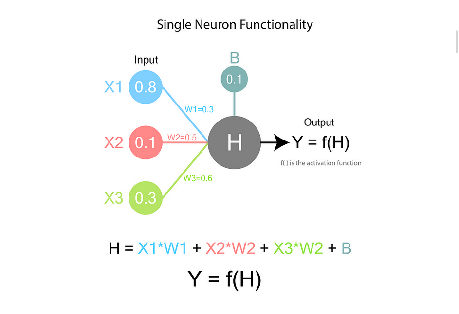

- y is the final output.

- X represents the values of the nodes of the previous layer.

- W represents the weights

- B represents the bias; provides adjustability which is not dependent on previous layer.

- H is the intermediate node value.

- f() is the activation function.

- if we represent the weights corresponding to each input node as vectors and arrange them horizontally, we form a matrix known as weight matrix.

- a MxN weight matrix means that the first layer has N nodes and the second layer has M nodes.

- The input layer is the external stimulus from which the neural network has to learn from.

- The output layer is where we are supposed to get the target value,this represents what exactly our neural network is trying to predict or learn.

- all layers in between are called hidden layers.

## ACTIVATION FUNCTION

- linear relationships are not desirable as the data often has non linear relationships between the input and output variables.

- activation functions are non linear in order for our neural net to be capable of fitting on non-linear data.

## Backpropgation

- uses chain rule and gradient descent.

- compute the error after first pass.

- now minimize the error.

- 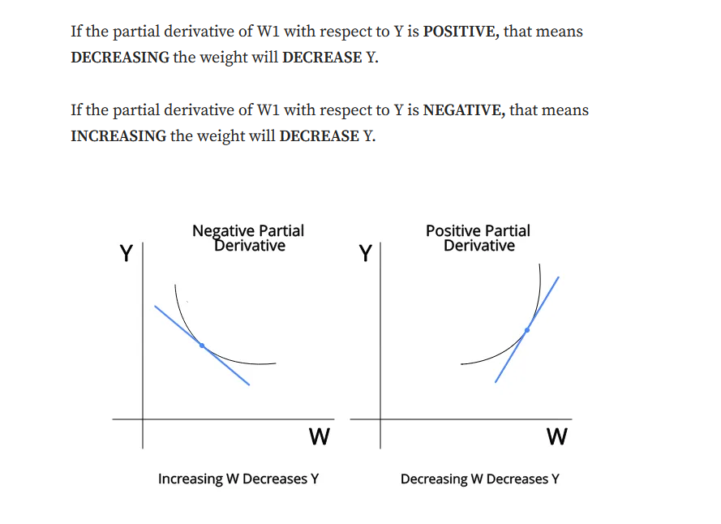

- as the last layer is closest to the error, we will first derive the last layer, then second last layer and so on.

## Error calculation

### Regression
- cont. value
- mean squared error

### classification

- ensure that the last layer of the neural net has a number of neurons equal to the number of the classes.

- last layer should have softmax activation.

- use log loss or categorical cross entropy.

## regularization

- to prevent overfitting

### L1 and L2 regularization

- L1 and L2 also known as Lasso and Ridge regression, respectively.

#### L2 (ridge)

- adds a penalty equal to the sum of the squared values of the weights.

- ```sh
    loss = loss + lambda*(summation(w_i^2))
    ```

#### L1 regularization

- adds a penalty equal to the sum of the absolute values of the weights.

- can lead to sparse models.

- ```sh
    loss=loss+lambda*(summation(|w_i|))
    ```
#### elastic net:

- combination of L1 and L2 regularization

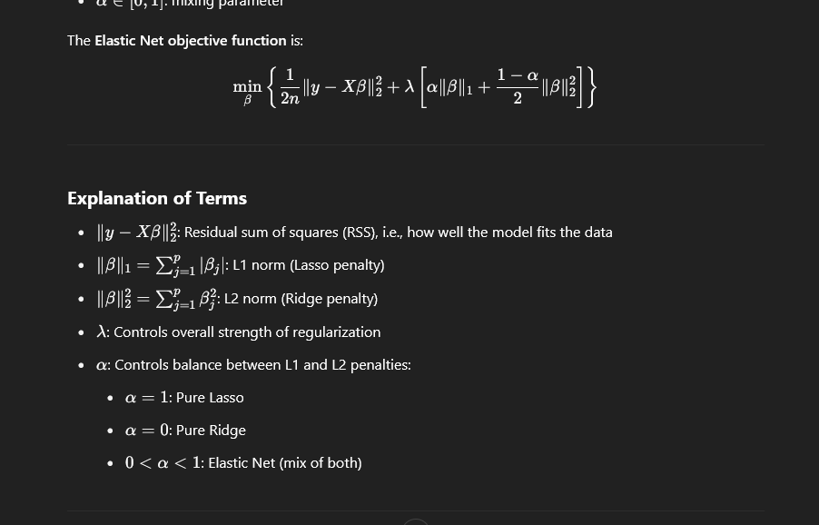

### Dropout

- drops out a subset of neurons during training. This prevents the network from becoming too reliant on any specific neuron, forcing it to develop redundant representations and improving generalization.

- hyperparameter p- denotes probability of dropping a neuron.

### Batch normalization 

- normalization is used to scale numerical data into a standard range.

- helps to convert  the entire data to same unit which helps in increasing the efficiency of model and ensures faster convergence.

- choosing small learning rate will increase the time of convergence.

- no need to worry about l.r with normalization

- batch normalization consists of normalizing activation vectors from hidden layers using the mean and variance of the current batch.

- increases efficiency of neural network

- reduce internal covariate shift.

#### Covariate shift

- it happens when distribution of input changes between training and live environments. The output distribution remains same.

- *Internal covariate shift*: change in the distribution of network activations due to change in network parameters during training.

#### Working

- uses mini batch gradient descent and applies to each layer

- ```sh
    x=(x-mean)/s.d
    ```

- scaling stage
- shifting stage 

- in testing use exponential weighted moving average- gives importance to recent data points while still considering older data points; places more weight on recent observation.

## Weight initialization strategy

- vanishing gradients: gradients become increasingly smaller as the algorithm works through lower layers

- exploding gradients: gradients may grow exponentially leading to disproportionately large updates and causing the learning process to diverge.

### Xavier/glorot initialization

- focuses on maintaining variance balance by using an initialization strategy based on the number of inputs and outputs in a layer.

- ideal for tanh/sigmoid

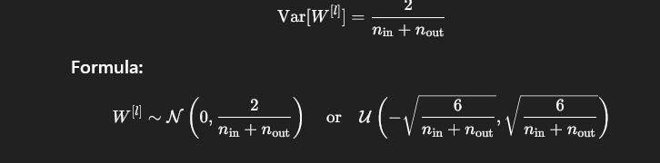

### He initialization

- tailored for relu, modifies the variance scaling according to the activation function used.

- 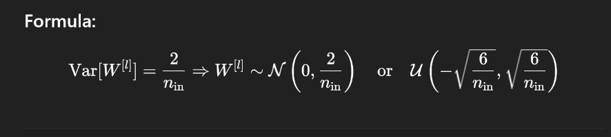

### Zero initialization

- W=0,b=0

### Random initialization(Naive gaussian)

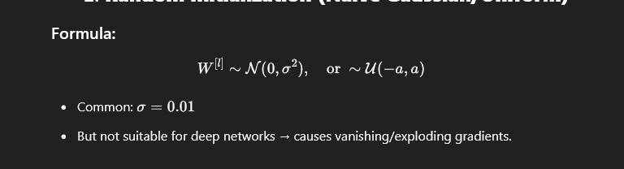

### Orthogonal initialization

- use an orthogonal matrix Q such that QTQ=I, which helps in maintaining norms during forward and backward passes.

- 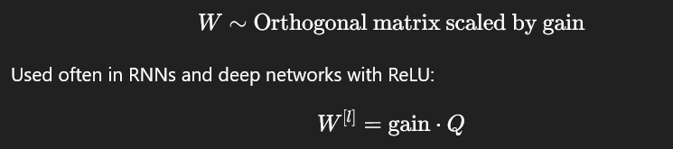

## Learning vs optimization

### Learning 

- refers to the process of finding a good function that maps inputs x to desired outputs y, based on a dataset D.

- to generalize well

#### components

- model

- loss function

- training data

#### generalization vs memorization

- learning involves finding patterns and generalizing.

- a model that memorizes training data but performs poorly on new data has failed to learn.

### optimization

- refers to the mathematical process of minimizing the loss function.

- to find weights that make the model perform well on the training set.

- gradient descent

- SGD

- Adam, RMSProp, Adagrad

- 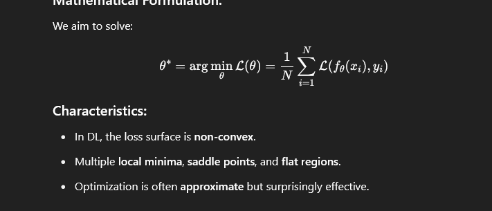

## Effective training in deep net

- good initialization

- right optimizer

- loss function design

- data preprocessing and augmentation

- regularization techniques

- monitoring and evaluation

- learning rate scheduling

- batch size and epochs

## Early stopping

- used to prevent overfitting by halting training when the model performance on a validation set stops improving.

- monitor validation loss during training. if the metric does not improve for a predefined number of epochs, stop training

## Normalization

### batch
- normalize across the batch dimension to make learning more stable by reducing internal covariate shift.

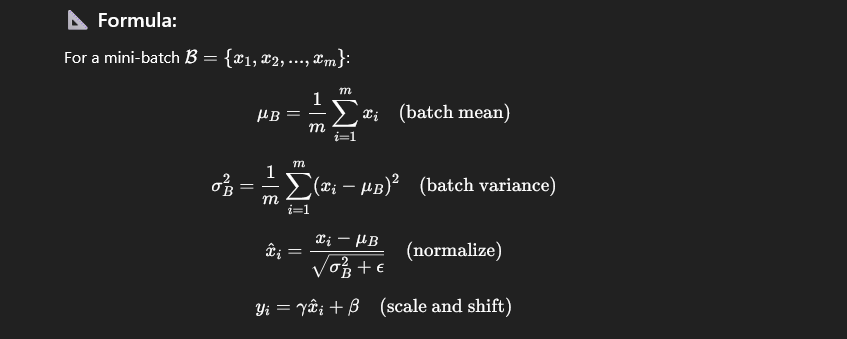

- batch mean

- batch variance

- normalize

- scale and shift

### Layer normalization

- normalize across features of each individual sample, not across batch

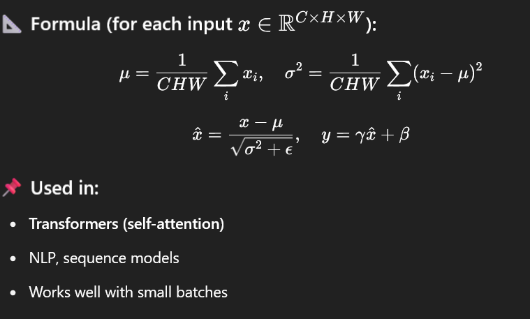

### instance 

- normalize each sample per channel, across spatial dimensions.

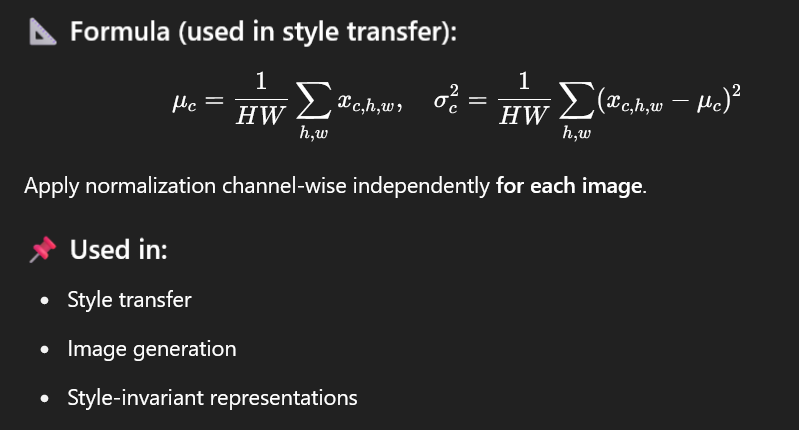

### Group

- divide channels into groups, normalise across spatial + within-group channels

- 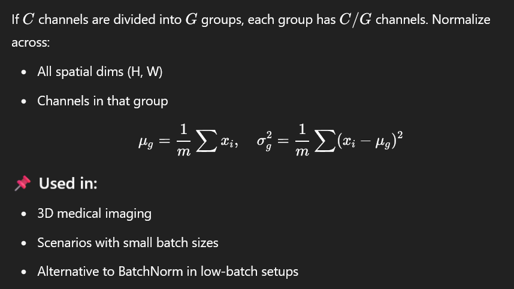

## batch gradient descent

- minimizes a loss function using the entire dataset to compute gradients at each step.

- at each iteration, compute the gradient of the loss function with respect to model parameters using the entire training dataset and update the parameters accordingly.

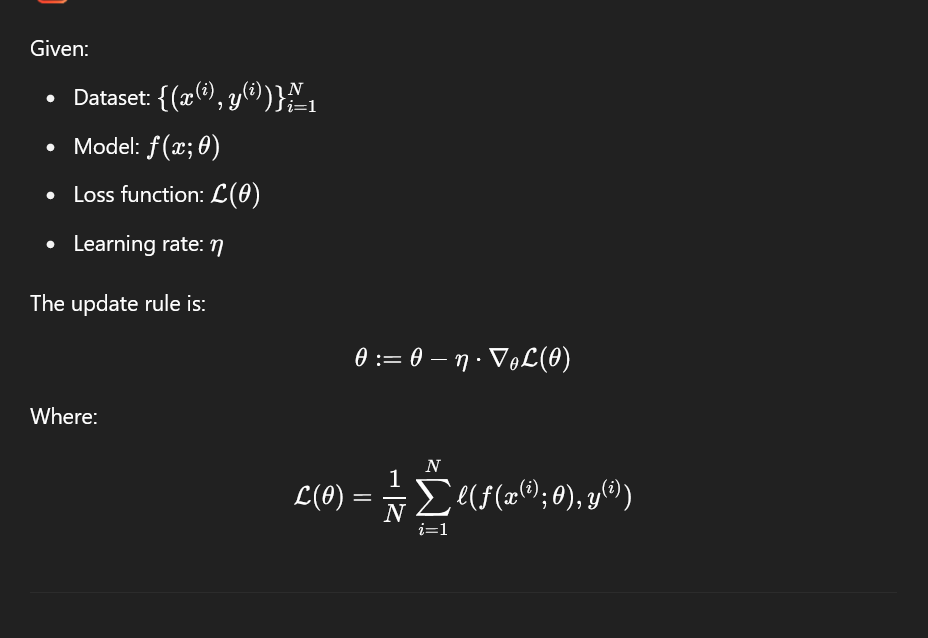

1. forward pass : compute predictions for the entire dataset.

2. Loss computation: evaluates total loss across all samples

3. Backward pass: compute gradients using backpropagation

4. parameter update: adjust weights using gradient descent rule.

5. Repeat until convergence


## GD with momentum

- accelerates learning by incorporating the past gradients to dampen oscillations and improve convergence, especially  in ravine-like cost surfaces

- standard gradient descent may be slow; might get stuck in local minima; oscillate in steep valleys.

- momentum helps by building up speed in consistent gradient directions and reducing speed in noisy ones.

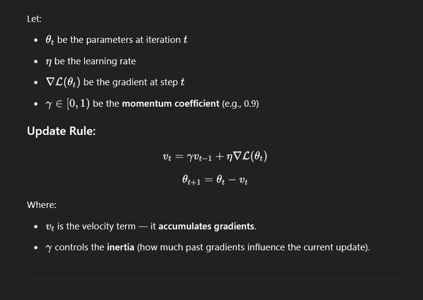

- on steep slopes: it accelerates

- in flat regions: keeps moving

- in ravines: dampens oscillations and helps converge faster.