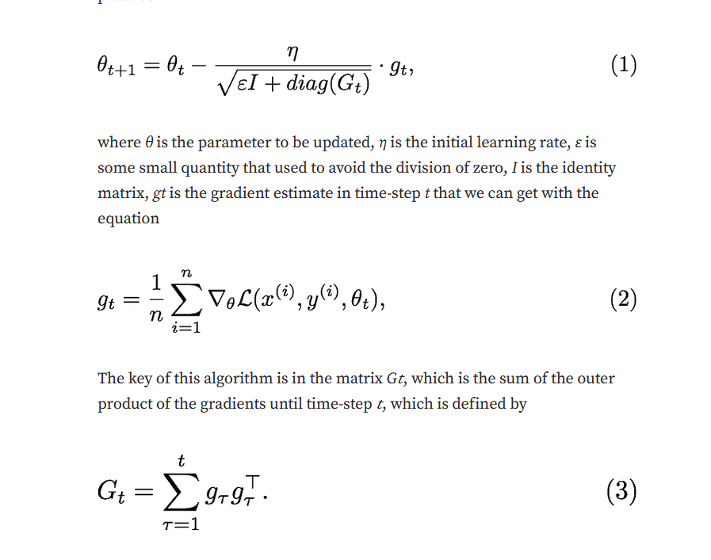
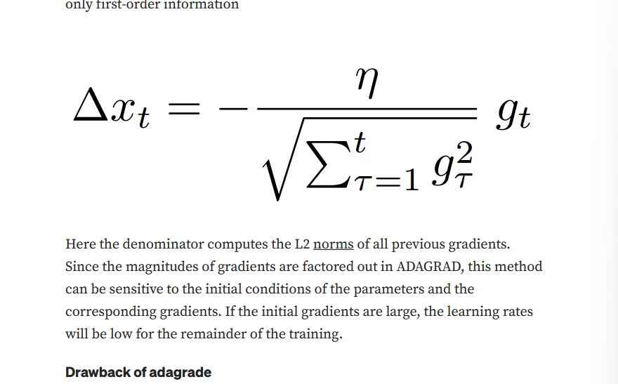
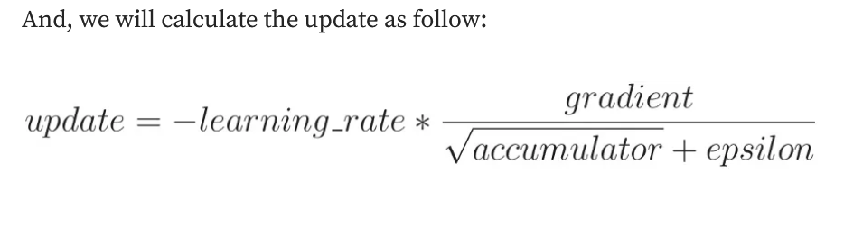

# ADAGRAD

- a hyperparameter is a parameter that has to be chosen manually before training. 

- if too small, the parameter update will be too slow. 

- if we set it too large, then the parameter will move all over the function and may never achieve acceptable loss at all.

- this algo adaptively scaled the learning rate for each dimension. 

- performs best for sparse data because it decreases the learning rate faster for frequent parameters, and slower for parameters infrequent parameter.

# Adadelta: adoptive learning rate method

- momentum can accelerate progress along dimensions in which gradient consistently point in the same direction and to slow progress along dimensions where the sign of the gradient continues to change.

## drawbacks of adagrad

1. decay of learning rates throughout training due to the continual accumulation of squared gradients in the denominator tends to vanishing gradients problem.

2. need for a manually selected global l.r.

## adadelta

- instead of accumulating the sum of squared gradients over all time, we restrict the window of past gradients that are accumulated to be some fixed size w where w<t. 

## Root mean square propagation

- collect square of gradients but in a restricted manner.

