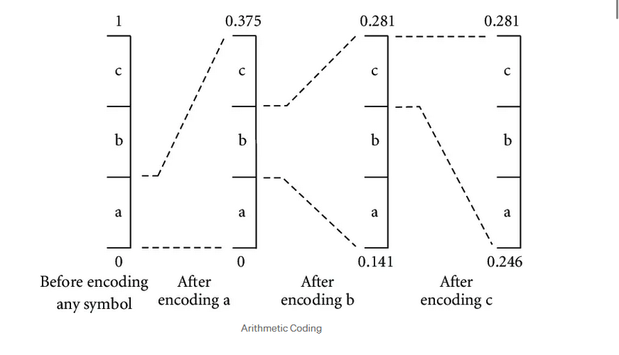
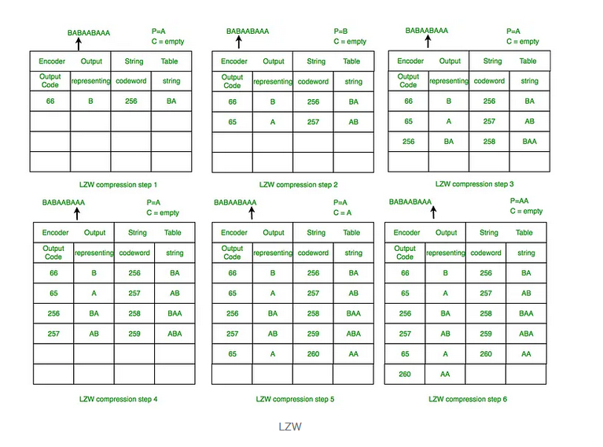
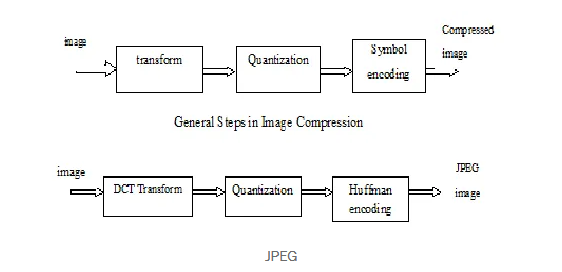
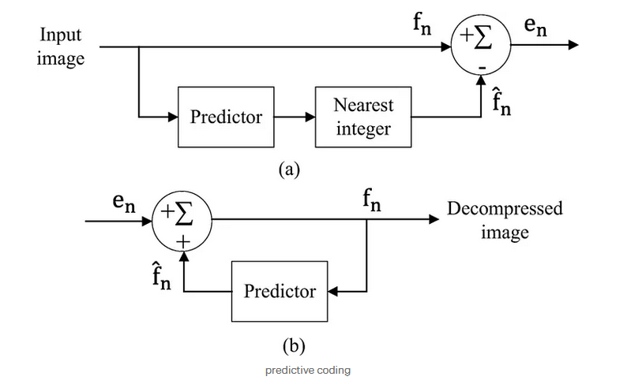
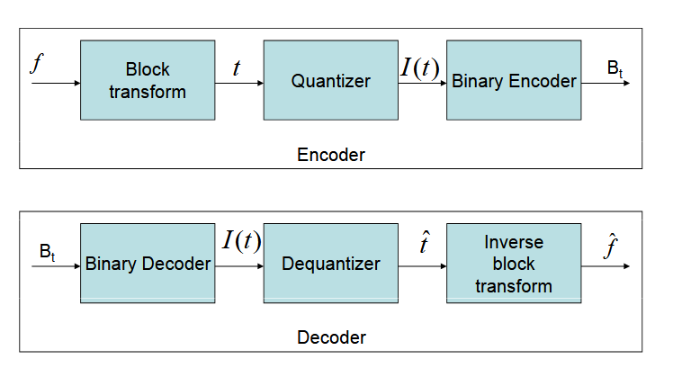
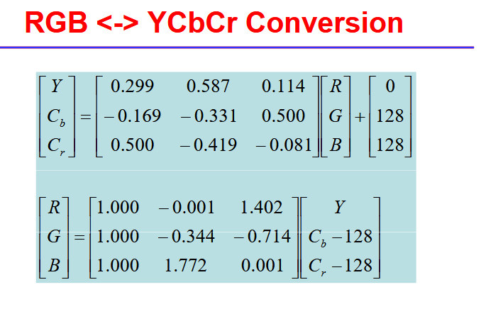
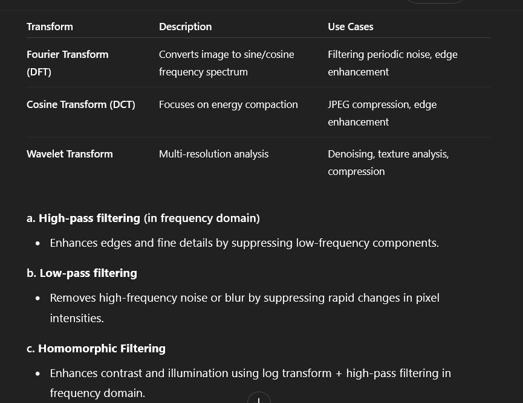
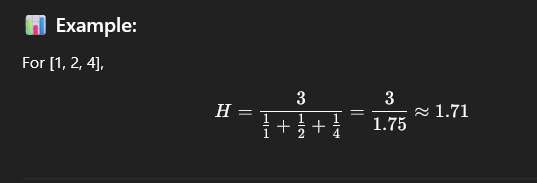

# compression
- high quality images often come with large file sizes that may slow down fast loading times, increase demands for storage space, and consume bandwidth. 
- compression is the process of reducing the file size of an image without losing much quality.

## Lossless compression:
- Lossless compression preserves all original image data.
- image is identical to the original.

### Run-Length Encoding:
- replaces sequences of identical pixel values with that value once and a count.
- highly effective for images with large uniform-colored regions.

#### Algo:

- Scan through the image and sequence of identical-color pixels.
- Replace the sequence with a pair of values: pixel value and count.
- store the compressed result; display and transmit it.

### Huffman coding: Variable length for more frequent pixels
- assigns more frequently occuring pixel values with shorter codes and rarer ones with longer codes. forms a huffman tree.
#### Algo:
- Count occurences of each pixel value in the image.
- create a binary tree, in which each pixel value is represented by a leaf node.
- Assign binary codes based on the tree structure. The values that appear the most should have the least number of digits in their binary codes.
- replace pixel values with the corresponding binary codes.

### Arithmetic coding: A single number for the whole image
- entire picture is encoded into a single floating point number that lies b/w 0 and 1, which in turn represents the entire sequence of the pixel values.
- encodes the whole message by taking the length of the entire number range b/w 0 and 1

#### ALGO:

- initialize a range from 0 to 1.
- assign probability range for each pixel value(based on frequency)
- refine the range progressively by narrowing it down as more pixels are encoded.
- output the range as the compressed data.

### Lempel-Ziv-Welch(LZW): dictionary based compression

- LZW is dictionary based compression wherein it replaces all the recurring patterns in a picture with short codes.

- LZW creates a dictionary of all sequences in a picture as it scans and processes, instead of replicating them again and again in the core memory, uses references to these sequences.



#### ALGO:
- Initialize the dictionary with basic pixel values(e.g. all individual pixel values.)
- Iterate through the image and search for recurring patterns.
- Add new patterns to the dictionary with a unique code.
- Replace patterns in the image with corresponding dictionary codes.

### JPEG
- uses combination of DCT, quantization and Huffman coding to compress an image in the frequency domain.
- Divides the image into small blocks and transforming the same with removal of less important information.



#### ALGO:
- Divide the image into small blocks of 8*8 pixels.
- Apply the DCT to convert each block from the spatial domain to the frequency domain. 
- quantize the DCT coefficients, reducing the precision of less important frequencies.
- apply Huffman coding to compress the quantized coefficients.
- recreate the image by applying the inverse steps during decompression.

### Predictive Coding
- works by predicting the pixel values based on neighbourhood pixels or previous frames.
- encodes b/w the predicted and the actual pixel value.
- useful for compressing the video and sequential image data.


#### ALGO:
- Predict the next pixel valur based on surrounding pixels or previous frames.
- encode the difference between the predicted and actual value.
- store or tranmit the residuals, leading to significant compression.

## Lossy compression

- achieves higher compression rates by discarding some of the original data.
- the degree of data loss depends upon the compression ratio(compressed file to original file.)

### JPEG

### Transform coding

- represent an image as the linear combination of some basis images and specify the linear coefficients.



### when to use
- many coefficients have small values and can be quantized to 0.
- the coefficients are uncorrelated



### Block truncation coding

- BTC is a simple and efficient lossy image compression technique that preserves statistical moments of small blocks of the input image in the quantized output.
- It is a 1-bit adaptive moment-preserving quantizer that retains the block mean and standard deviation.

- the image is divided into non-overlapping blocks. Each block is compressed independently using statistical properties like mean and standard deviation of the pixel values.

#### Encoding
1. Divide the image into blocks
2. Calculate the mean of the pixel intensities in that block.
3. Create a bitmap:
    - Each pixel is set to 1 if its value >= mean
    - otherwise it is set to 0
4. Compute 2 quantizer values:
    - High value(h): mean of pixels>= mu
    - Low value(l): mean of pixels< mu
5. Store the bitmap + two values (h,l) as compressed data.

## Enhancement in spatial domain

- 
- spatial filtering 

## in Transform domain

- in frequency domain
- apply a transform
- modify frequency components
- apply inverse transform to get enhanced image.




## Directional smoothing

- noise reduction technique that preserves edges better than standard smoothing(mean filtering) by considering the orientation of the neighboring pixels.

### How it works
- For each pixel define several directions.
- For each direction, compute a local average of pixels along that direction
- Select the direction where the average is closest to the central pixel value.
- Replace the pixel with this directional averge - preserving edges in that direction.

## Harmonic mean


## Homomorphic filtering
- It is a powerful image enhancement technique that operates in the frequency domain to simultaneously correct non-uniform lighting(illumination) and enhance image contrast(reflectance).

- illumination : low frequency
- reflectance: high frequency

- use filtering to reduce uneven lighting and enhance fine details.

- ```sh
    f(x,y)=i(x,y).r(x,y)
    ```
- i(x,y)=illumination
- r(x,y)=reflectance

- more suitable, take log

### Steps

- take log of image
- apply fourier transform
- apply high-pass filter
- inverse fourier
- take exponential