# Binarization:

- process of converting a grayscale image to a binary image, where each pixel is assigned one of only 2 possible intensity values: typically 0 or 255.

- used in image segmentation to separate foregroun(objects of interest) from the background.
    - OCR
    - Document scanning and analysis
    - Barcode detection
    - Image thresholding
## Steps

- achieved through _thresholding_:
    = A threshold value (T) is chosen
- Every pixel in the grayscale image is compared to T.
    - If the pixel intensity is greater than or equal to T, it is set to white.
    - less than T, set to balck(0)

- Types of thresholding:
1. *Global*: single threshold for entire image.
2. *Adaptive*: different values for different regions
3. *Otsu's Method*: An automatic thresholding method that chooses the optimal thresholding by minimizing the intra-class variance.

# limits of sets

- the limit of sets refer to a concept used to describe the convergence of a sequence of sets.

## Limit inferior of sets:
- 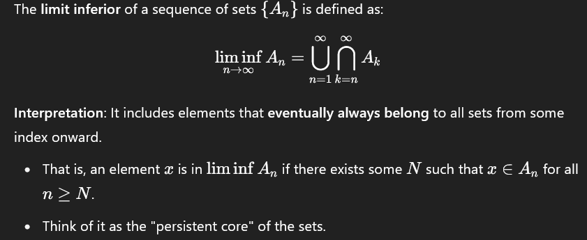
- includes elements that eventually always belong to all sets from some index onward.
## Limit superior of sets:

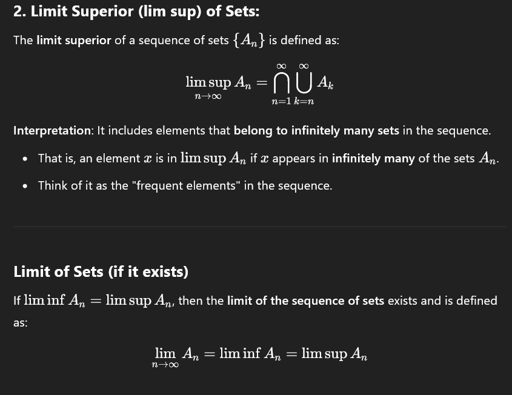
- includes elements that belong to infinitely many sets in the sequence.

## Application
- In image processing, especially in mathematical morphology, sequences of binary images can be considered as sets of foreground pixels. The concept of limit of sets helps in:

    - Analyzing convergence of iterative operations (e.g., repeated dilation or erosion).

    - Defining stable patterns that persist after multiple processing steps.

    - Understanding asymptotic behavior of image transformations.
# Morphological operations

- A = input binary image
- B = structuring element(a small shape like a disk, square or cross, used to probe the image).

## Erosion(A-B)
- shrinks objects by removing pixels on object boundaries.
    
    - 

- B_z: structuring element B translated to point z.
- keeps only points where B fits entirely within A.

- *effects*: 
    - removes small objects.
    - breaks narrow connections.
    - shrinks shapes.

## Dilation(A+B)
- grows objects by adding pixels to boundaries.

    - 

- B_cap: reflection of B about its origin.
- Adds a pixel if any part of B overlaps with foreground.

- *effects*:
    - fills small holes
    - connects nearby objects
    - expands shapes

## Opening (AoB)

- 

- erosion followed by dilation.

- *effects*:
    - removes small objects/noise.
    - preserves shape and size of large objects.

## Closing(A.B)

- 

- dilation followed by erosion.

- *effects*:
    - fills small holes or gaps.
    - connects nearby components.
    - smooths object boundaries.

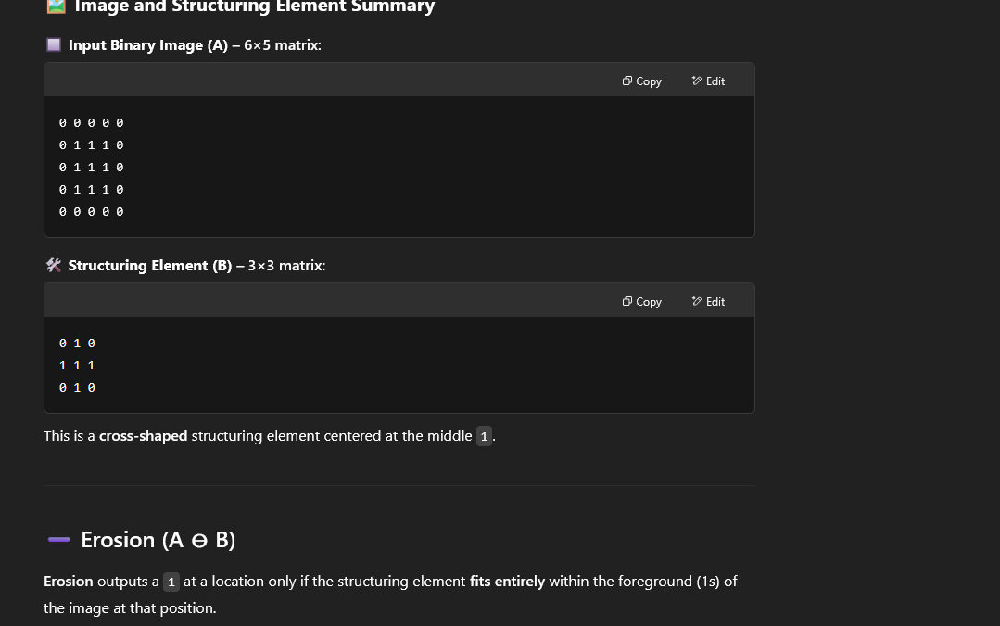
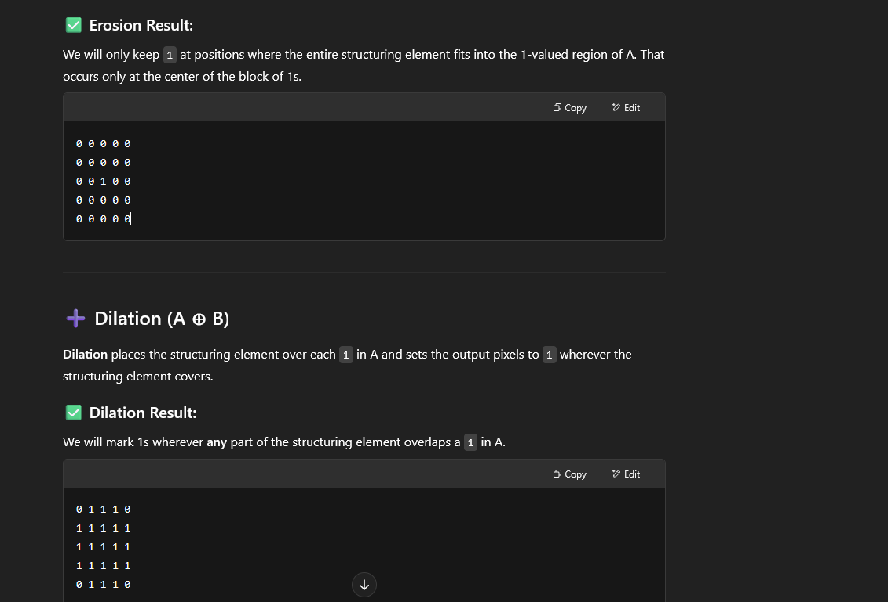
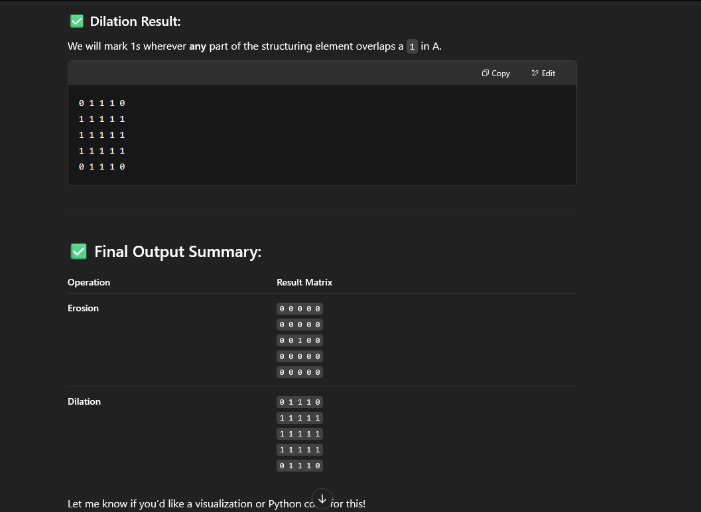

# Color image representation

- A color image is a digital image that includes color information for each pixel. Unlike grayscale images (which store only intensity), color images represent a combination of colors, typically using three color channels.

## RGB color model

- The most widely used format for color image representation is the RGB model.

    - Each pixel is represented by three values:

        - R: Red intensity

        - G: Green intensity

        - B: Blue intensity

- 📐 Structure:

    - Stored as a 3D array of size:
    - Height×Width×3
    - Height×Width×3

    - Each channel is a 2D matrix of intensity values typically 8-bit, ranging from 0 to 255).

- Example:

- For a single pixel:

    - (R,G,B)=(255,0,0)(R,G,B)=(255,0,0) → Pure Red

    - (0,255,0)(0,255,0) → Pure Green

    - (0,0,255)(0,0,255) → Pure Blue

    - (255,255,255)(255,255,255) → White

    - (0,0,0)(0,0,0) → Black

## Other color models

### HSV

- Hue: Type of color (angle on color wheel, 0–360°)

- Saturation: Intensity or purity of color (0–1)

- Value: Brightness (0–1)

- 🟢 Often used in color filtering and object detection because it's closer to human perception.

### YCbCr(Luminance-Chrominance)

- Y: Luminance (brightness)

- Cb: Blue chrominance

- Cr: Red chrominance

- 📺 Common in video compression (JPEG, MPEG).

### CMYK(Cyan, magenta, yellow,black)
- used in printing 
- subtractive model

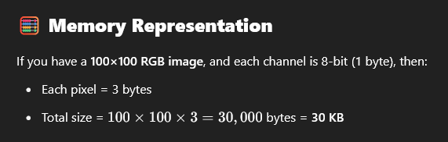

# Thinning

- reduces objects in a binary image to their skeletal form without breaking them apart.
- used to extract the skeleton or medial axis of shapes.
- operates by iteratively removing pixels from the boundaries without eroding the overall connectivity.

- 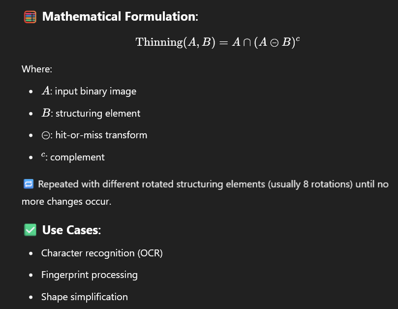

# Thickening

- adds pixels to the object boundaries based on a rule defined by a structuring element.

    - It is used to grow shapes in a controlled manner
    - enhances object structure without merging close objects.

- 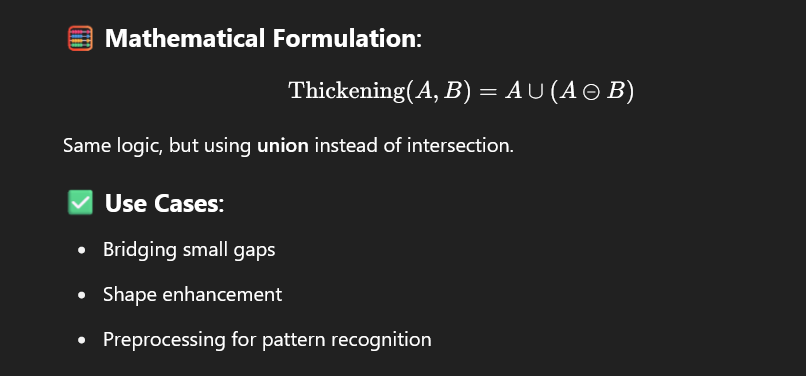

## steps 

### thinning
1. apply hit-or-miss transform using a structured element.
2. Subtract matched pattern pixels from the original image.
3. Repeat using all 8 rotated structuring elements.
4. Iterate until the image stops changing.

### thickening

1. Apply hit-or-miss transform
2. Add matched pixels to the original image.
3. repeat using all rotations.
4. iterate until stabilization.

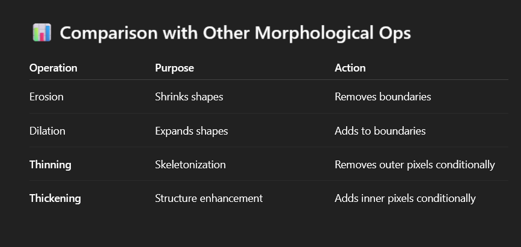

## skeletonization

- to reduce objects to their true geometric skeleton - the set of all points equidistant from the object boundaries.

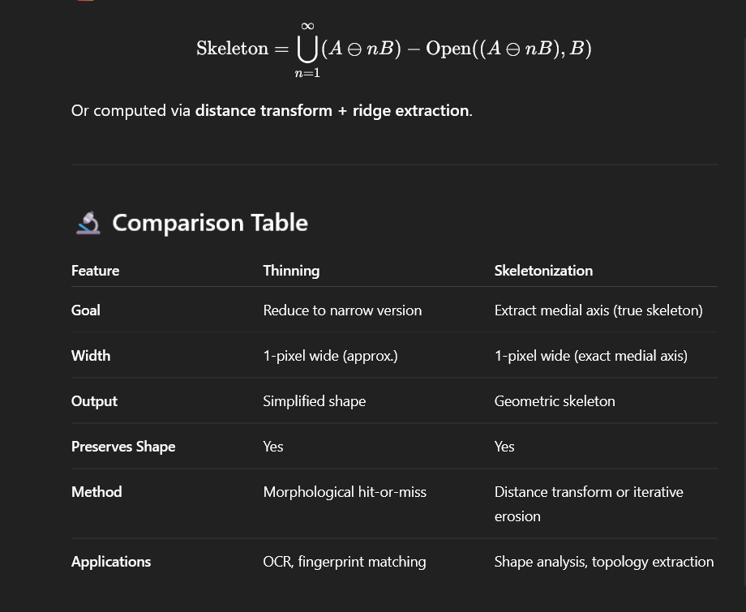

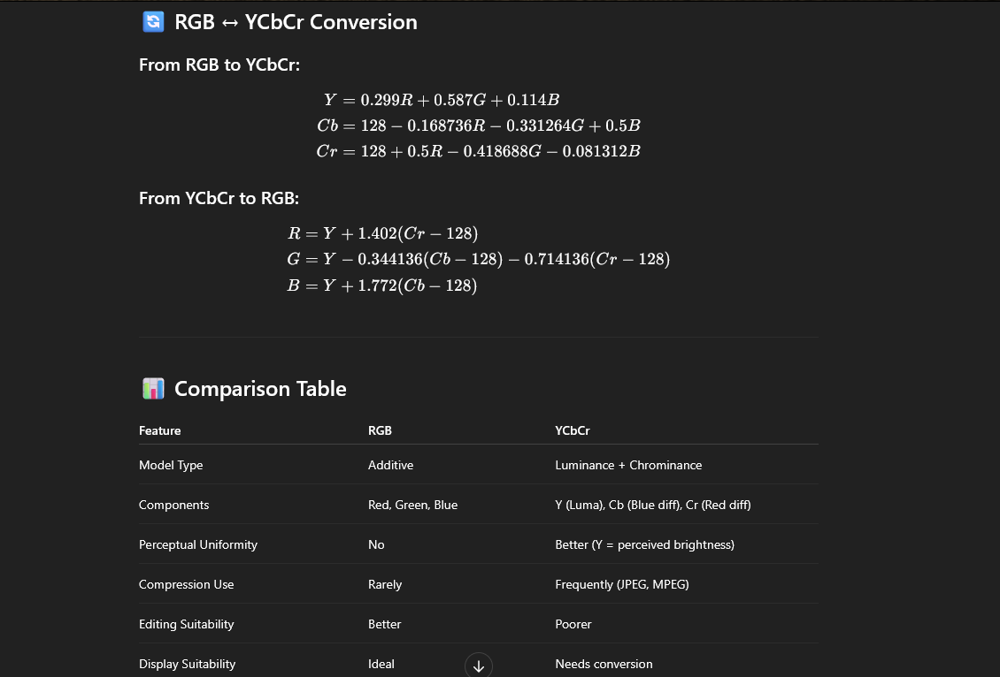

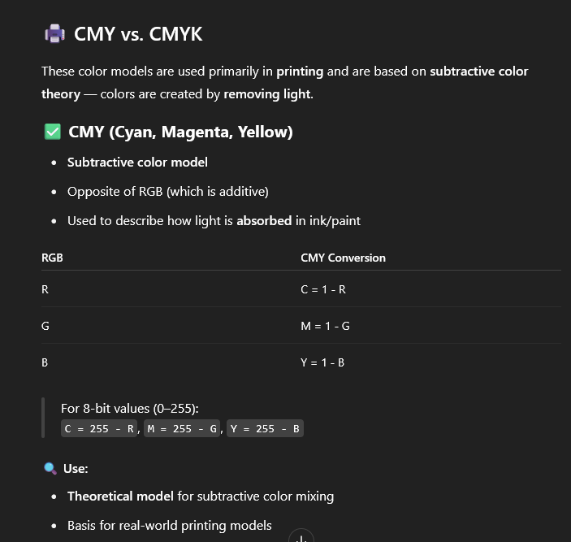

| Feature      | **CMY**                 | **CMYK**                         |
| ------------ | ----------------------- | -------------------------------- |
| Type         | Subtractive color model | Subtractive model with black ink |
| Components   | Cyan, Magenta, Yellow   | Cyan, Magenta, Yellow, Black     |
| Use          | Theoretical model       | Practical printing model         |
| Disadvantage | Poor black rendering    | Solves this with separate K      |
| Applications | Color theory, modeling  | Printers, PDF rendering          |

## HSI

| Component          | Meaning                              | Range             |
| ------------------ | ------------------------------------ | ----------------- |
| **Hue (H)**        | Type of color (angle on color wheel) | 0° to 360°        |
| **Saturation (S)** | Color purity (how gray it is)        | 0 to 1 (or %)     |
| **Intensity (I)**  | Brightness of the color              | 0 to 1 (or 0–255) |

### RGB TO HSI

| Feature         | **HSI**                    | **HSV** (Value)           |
| --------------- | -------------------------- | ------------------------- |
| Intensity Basis | True average of RGB        | Max of R, G, B            |
| More Accurate   | For human vision modeling  | For computer vision usage |
| Use Cases       | Color correction, analysis | Color detection, UI tools |

| Feature                  | **HSI** (Hue, Saturation, Intensity) | **HSV** (Hue, Saturation, Value)      |
| ------------------------ | ------------------------------------ | ------------------------------------- |
| **Hue (H)**              | Angle on color wheel (same in both)  | Same as HSI                           |
| **Saturation (S)**       | Measures *color purity* vs gray      | Measures *colorfulness* vs brightness |
| **Brightness Component** | **I = Average of RGB**               | **V = Max(R, G, B)**                  |
| **Purpose**              | Human perception and analysis        | User interface, lighting effects      |
| **Shape**                | Double cone                          | Hexcone                               |
| **Use Cases**            | Image analysis, segmentation         | Color pickers, UI design              |

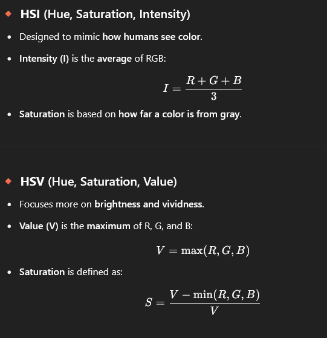

### BASICS OF COLOR IMAGE PROCESSING

- Color image processing is a branch of digital image processing that focuses on manipulating and analyzing color images using various models and techniques to enhance, segment, compress, or understand images.

## Spatial filtering

- Spatial filtering refers to operations applied directly on the image pixel neighborhood to enhance, sharpen, blur, or detect features. When applied to color images, spatial filtering becomes more complex due to multiple channels.

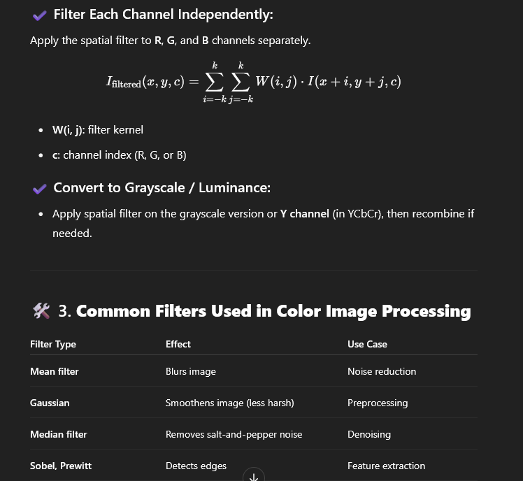

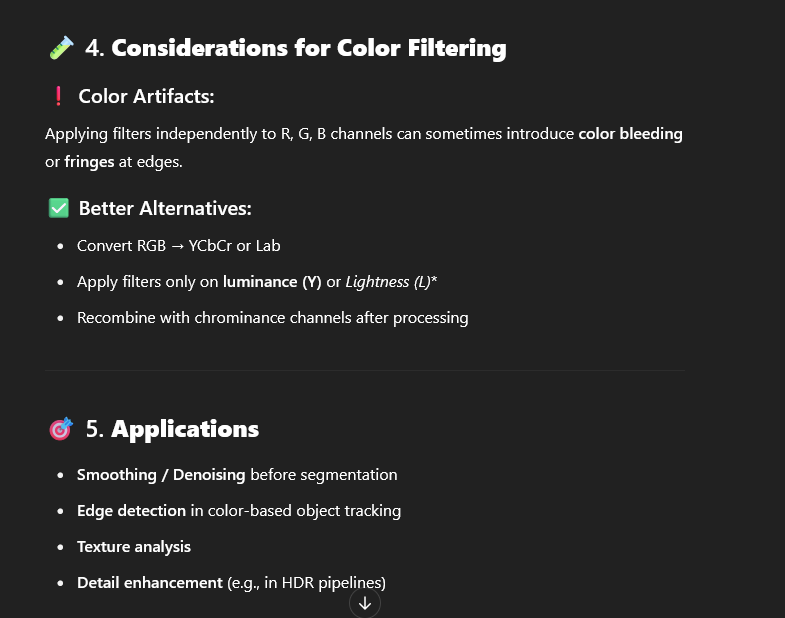