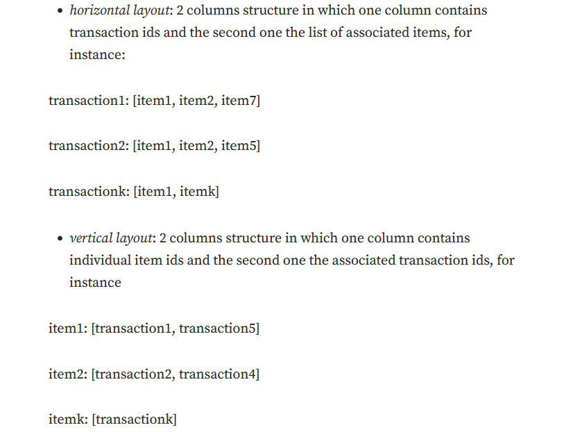
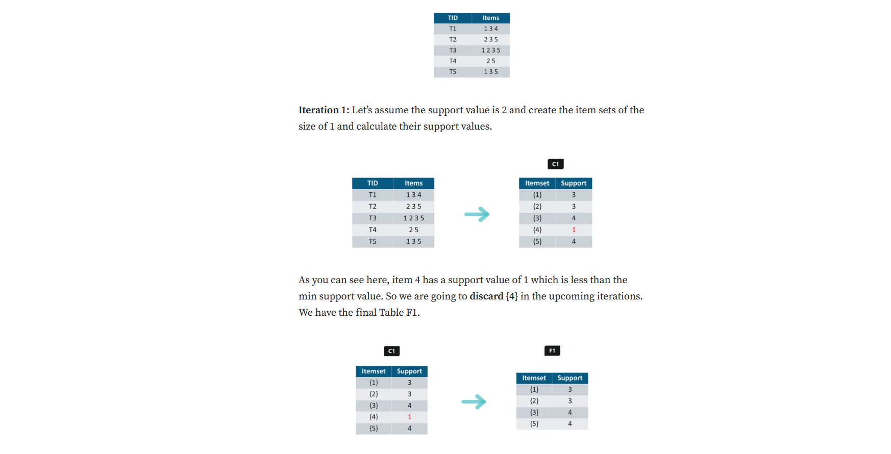
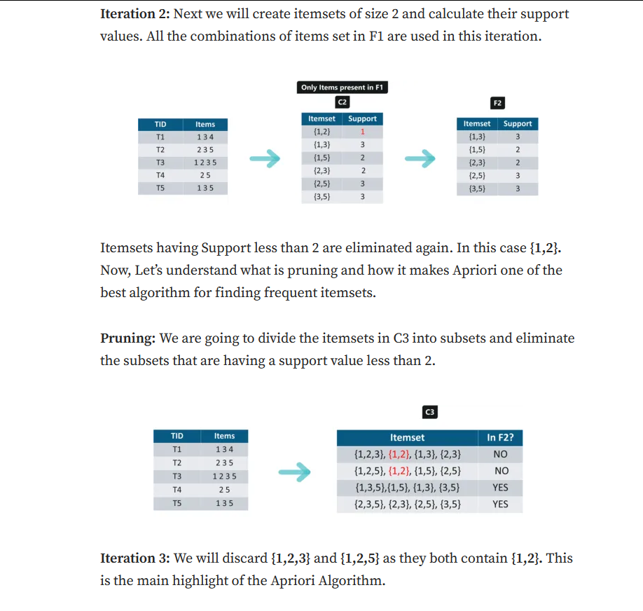
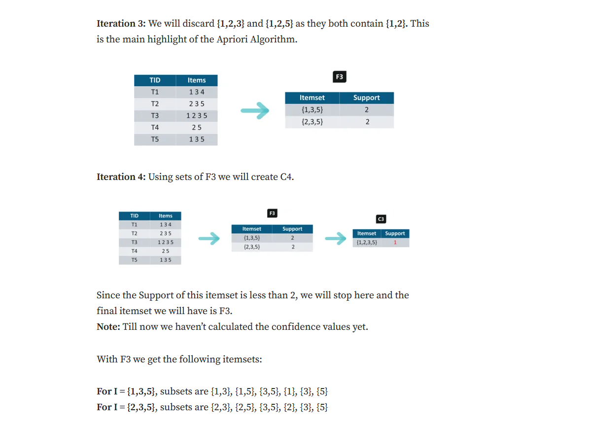
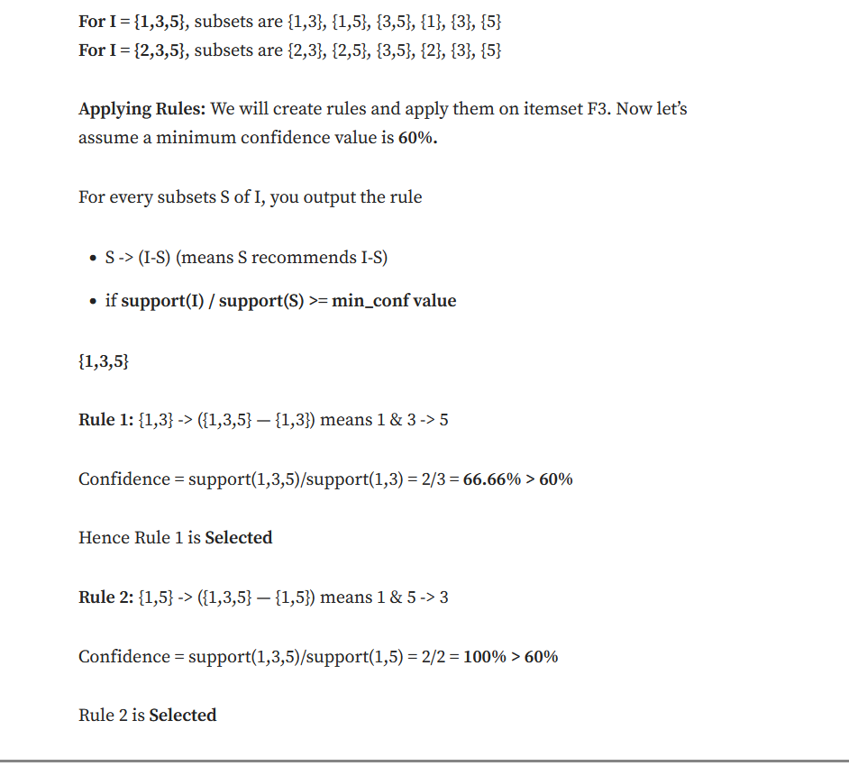

# Apriori

## Frequent Pattern Analysis

- A pattern(a set of items, subsequences,substructures) that occur frequently in a data set

- can reveal association rules and relations between variables. 
- input data is stored as a collection of transactions.
- transaction is a collection of items which have been observed together.
- transaction_id

- 2 architectures
- horizontal layout: 2 column structure in which one column contains transaction ids and the second one lists the associated items

- vertical layout: one column contains individual item ids and the second one associated transaction ids

- a frequent pattern represents a set of items co-occuring in comparatively more transactions.
- this frequency is quantified using the support metric

- *Itemset support*: number of transactions where the itemset elements appear together divided by the total number of transactions.

- *Minimum support*: threshold used by algorithms in order to discard sets of items from the analysis which don't appear frequently enough.

- The strength of the association rule between 2 items, or the association confidence represents the number of transactions containing item1 and item2 divided by the num of transactions containing item1.

- confidence= count(item1 & item2)/count(item1)

- lift(item1->item2)=(confidence(item1->item2))/support(item2)

- if lift >1; item 1 and 2 are more likely present together in transactions

## Asosociation vs Correlation

### Correlation
- correlation is from -1 to 1.
- -1 indicates perfect negative relationship. high values of one variable are associated with low values of the other.

- +1 describes a perfect positive relationship. 

- 0 indicates no relationship.

- most common pearson correlation coefficient.

- assumes both variables are normally distributed.
- linear
### association
- non-linear
- works when one or both of the variables is either ordinal or norminal.
- includes measures such as phi, gamma, kendall's tau-b

## Market basket analysis

- involves analyazing large datasets such as purchase history, revealing product groupings and products that are likely to be purchased together.

- works by looking for combinations of items that occur together frequently in transactions.
- takes data at the transaction level, which lists all items bought by a customer in a single purchase.

- "Frequently bought together"-> association
- "Customers who bought this item also bought"-> recommendation

## Association rule mining

- *Antecedent*(IF): found in itemsets
- *Consequent*(THEN): comes along as an item with an Antecedent/group of antecedents.
## Apriori algo

- uses frequent itemsets to generate association rules.

- based on the concept that a subset of a frequent itemset must alo be a frequent itemset.

- frequent itemset is an itemset whose support value is greater than a threshold value.

## Frequent pattern growth algo

- avoids high computational costs by compressing the data into 