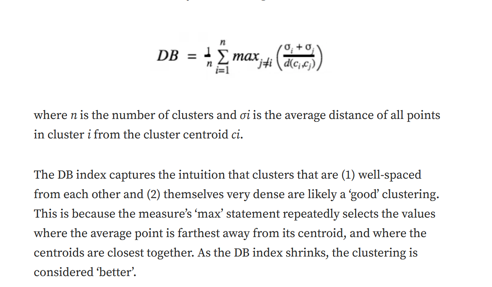

# CLustering 

- An unsupervised learning approach where we donot know the label of the data. It is used to visually get a sense of how many potential groupings are there in the data.

- clustering: unlabelled data is divided into groups with similar data instances assigned to the same cluster while dissimilar data instances are assigned to different clusters.

- various uses in market segmentation, outlier detection and network analysis.

###### centroid-based/(k-means)
###### connectivity-based(Hierarchical Clustering)
###### Density based(DBSCAN)
###### Graph based(Affinity propagation)
###### Distribution-based(Gaussian Mixture Model)
###### Compression-based(Spectral clustering, BIRCH)

## Centroid based
- it groups data points together based on the proximity of data points to the centroid(cluster center).

- proximity is measured by:
    - Euclidean distance
    - Manhattan distance
    - Hamming distance
    - Mahalanobis distance
    - Minkowski distance
    - Chebyshev distance: max absolute diff

### K-Means

- involves initialization and performing iterative Expectation Maximization steps until convergence or when maximum iteration is reached.

- During initialization, k number of centroids are assigned based on the k-means optimization algorithm.

- In the Expectation step, data points are assigned to clusters following their closest centroid.

- In Maximization step, centroids are updated to minimize the inertia or within-cluster sum-of-squares.

- EM steps are repeated until convergence to local minima where the cluster assignment and centroids do not change.

#### when to use
- interpretability
- clusters are even sized

- A clusering output is preferable if and only if the data assigned inside each cluster are homogeneous to each other enough.

- Diameter of a cluster is the measure of how far the 2 farthest points in a cluster are located.

- *hard clustering*: one data point belongs to one cluster
- *soft clustering*: one data point can be part of multiple clusters.

## connectivity-based

- these methods group data points together based on the proximity b/w the clusters.

### linkage criterion:

- *Single linkage*: distance b/w closest points of clusters; min distance b/w clusters. good for arbitrarily shaped clusters but cannot detect overlapping clusters. not robust to noisy data.

- *Complete/maximum linkage*: Distance b/w furthest points of clusters; maximum distance b/w clusters. good for overlapping clusters.

- *Average linkage*: average of all distances across 2 clusters.

- *Centroid linkage*: distance b/w centers of 2 clusters.

- *Ward linkage*: sum of squared distance from each data point to the centroid of the cluster they are assigned to; leads to cluster merging; gives the smallest increase in total variance within all clusters.

### Hierarchical clustering

- Agglomerative heirarchical clustring works by doing an iterative botttom-up approach where each data point is considered as an individual cluster and the two closest(by linkage criteria) clusters get iteratively merged until one large cluster is left.

- Divisive hierarchical clustering does the opposite and performs an iterative top-down approach where it starts from one large cluster and continuously breaks down into 2 smaller clusters until every data point is an individual cluster.

#### When to use

- unsure about the number of clusters
- computatuon efficiency
- high dimensional data

## Density-based
- groups data points together based on density instead of distance

### Density-Based Spatial Clustering of Applications with Noise

- Clusters data points that are in a dense region together, separated by areas of low density. 

- Samples in denser areas within eps units apart with more than min_samples number of data points are called *core samples*.

- It is a density-based clustering method, grouping dense clouds of data points into clusters. Any isolated points are considered not part of clusters and are treated as noises.

- The DBSCAN algorithm starts by randomly selecting a starting point. If there are a sufficiently large number of points near that point (defined by a predetermined distance threshold), then those points are considered part of the same cluster as the starting point. 

- The neighborhoods of the newly added points are then examined. If there are data points within these neighborhoods, then those points are also added to the cluster. 

- This process is repeated until no more points can be added to this particular cluster. Then, another point is randomly selected as a starting point for another cluster, and the cluster formation process is repeated until no more data points are available to be assigned to clusters 

- Clusters are dense regions of data points separated by areas of low density.
- Key Parameters:

    - ϵϵ: Radius for neighborhood

    - minPtsminPts: Minimum points required to form a dense region

- Definitions:

    - A point is a core point if it has ≥ minPts neighbors within ϵϵ

    - A point is a border point if it's reachable from a core point but has < minPts

    - A point is noise if it's neither

- Algorithm:

    - Step 1 — Identify all points as either core point, border point or noise point.

    - Step 2 — For all of the unclustered core points.

    - Step 2a — Create a new cluster.

    - Step 2b — add all the points that are unclustered and density connected to the current point into this cluster.
    - Step 3 — For each unclustered border point assign it to the cluster of nearest core point.

    - Step 4 — Leave all the noise points as it is.
- detects outliers
- no stable performance

## Graph based
- basrd on graph distance

### Affinity propagation
- works by pair-wise sending of messages between data points until convergence.

## Distribution-based
- group data points together based on their likelihood of belonging to the same probability distribution

- use statistical inference to cluster data such that the closer the data point is to a central point.

### Gaussian Mixture Model
- assumes that every data point is generated from multiple Gaussian distributions with unknown parameters and performs iterative EM steps to fit the data points.
## Compression-based
- transform data points to an embedding and subsequently perform clustering on the lower-dimension data
### Spectral clustering
- transforms the affinity matrix between data points to a low-dimension embedding before performing clustering.

## Agglomerative clustering

- It is a bottom-to-up approach of Hierarchical clustering.- It follows a very simple pattern of clustering, it starts by identifying two points closest to each other in terms of distance, & this approach continues recursively until the whole data is clustered.
- It will create “n” clusters, each for one data point.
- It will create a “proximity matrix”, also known as “distance matrix” or “similarity matrix”. Each value in that matrix corresponds to the distance between each & every point. If there are 10 points let’s say, then the matrix will be of dimension 10 x 10, calculating distance for each & every point to each & every other point.
- After the formation of a cluster, the proximity matrix is updated.
- The above step is repeated until there is no point left in the dataset to cluster.

## Self organizing maps

- neural model
- provides a data visualization technique that helps to understand high dimensional data by reducing the dimension of data to map. SOM groups similar data together.

- uses a competitive learning approach.

### Training
- Initialization: the neurons in the map are initialized with random weight vectors

- Competition: for each input data point the SOM finds the "Best matching Unit", whuch is the neuron whose weight vector is most similar to the input data point. The neurons compete to be the BMU.

- Cooperation: Once the BMU is identified, its weight vector and the weight vectors of its neighboring neurons are adjusted. The degree of adjustment depends on a neoghborhood function which shrinks over time. It ensures similar data points are mapped to nearby neurons

- Adaptation: The weights of the BMU and its neighbors are updated to become more like the input data point. repeated for many iterations, with the larning rate and neighborhood radius gradually decreasing.

### MAPPING

- the SOM can be used to classify new input data. for any new data point, the closest neuron on the trained map is identified, effectively classifying the data point into the cluster represented by that neuron.

## Cluster evaluation

### internal evaluation

- based on cohesion and separation

#### silhouette coefficient
- measures how similar a point is to its own cluster compared to other clusters.

- if S(i) is close to 0, it is right at the inflection point b/w 2 clusters. 
- if closer to -1, then we would have been better off assigning it to the other cluster.
- if closer to 1, then well assigned
#### Davies-Bouldin Index

#### Dunn Index

### External evaluation
- results compared to ground truths
- rand index

## Complex data 
- multimedia
- time-series
- spatial data-related to geographical locations
- spatiotemporal data- combines spatial and temporal
- text data
- graph and network
- multirelational data

# Testing

## Significance testing

- Determines whether observed results are statistically significant.
- helps control type 1 error: incorrectly rejecting a true null hypothesis
- a small p-value indicates strong evidence against H0, suggesting a true effect.

## Hypothesis testing

- 2 groups
    - null hypothesis- chance is considered as the root cause of the difference
    - alternative hypothesis- counterpoint to null hypothesis is accepted.

- determine a model
- determine a mutually exclusive null and alternative hypothesis.
- determine a test statistic
- determine a significance level. alpha, i.e. probability of rejecting null hypothesis when Ho is true.

- if we decide to reject the null hypothesis then the findings from the experiment as a whole is called significant.

- test statistic is a function of random variables.

- p-value: probability that the test statistic takes on its current value or a more extreme one, assuming that the null hypothesis is true.

- type 1 error: we reject H0 when H0 is actually true.
- type 2 error: we donot reject H0 when HA is actually true
