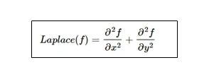

# DIP
- An image may be defined as a 2-dimensional function,f(x,y) where x an d y are spatial coordinates and the amplitude of f at any pair of coordinates is called the intensity or the gray level of the image at that point.

- when x,y and the amplitude values of f are all finite, discrete quantities we call the image a digital image. The field of digital image processing refers to processing digital images by means of a digital computer.

- Pixels- An image is composed of a finite number of elements, each of which has a particular location and value.

- digital image preprocessing also involves working with images from ultrasound, electron microscopy and computer generated images.

- Low level process is characterized by the fact that both its inputs and outputs are immages.

- Mid-level processing on images involves tasks such as segmentation, description and classification. inputs - images; outputs - attributes extracted from those images.

- High-level processing involves "making sense " of an ensemble of recognised objects, image analysis.

- _Image Processing_: The process of acquiring an image of the area containing the text, preprocessing that image, extracting the individual characters, describing the characters in a form suitable for computer processing and recognising those individual characters.

- One way is to categorize the images by their source of origin(eg visual,X-ray). 
    - Principle energy source for images today- elctromagnetic energy spectrum. Others include acoustic,ultrasonix and electronic.
    - Synthetic images are generated by computers.
- EM waves can be seen as propagating sinusoidal waves of varying wavelengths. Each bundle of energy is called photon.

### Gamma-Ray Imaging
- Major uses of imageing based on gamma rays include nuclear medicine and astronomical observations.
- Images are produced from the emissions collected by gamma ray detectors. The patient is given a radioactive isotope.

### X-ray imaging
### Imaging in the ultraviolet Band

## Fundamental steps in digital image processing 
- _Image acquisition_: It is the most basic step, involves preprocessing such as scaling.
- _Image enhancement_: It brings out the details that is obscured or simply yo highlight certain features of interest in an image.

- _Image restoration_: it is an area that also deals with improving the appearance of an image. Enhancement is subjective, restoration is objective. They are based on mathematical or probabilistic models.

- _Color image processing_:  extracts fratures of interest in an image.

- _Wavelets_: foundation for representing images in various degrees of resolution.

- _Compression_: techniques for reducing the storage required to save an image or the bandwidth required to transmit it.

- _Morphological processing_: deals with tools for extracting components that are useful in the representation and description of shape.
- _Segmentation_: Partitions an image into its cinstituent parts or objects. 
- _Representation and description_: follows the output of a segmentation step, which is a raw pixel data, constituting either the boundary of a region or all the points in the region. Boundary representation is appropriate when the focus is on external shape characterstic such as corners and inflections. Regional representation is appropriate when the focus is on internal properties,such as texture or skeletal shape.
    - _Description_ also called as feature selection, deals with extracting attributes that result in some quantitative information of interest or are basis for differentiating one class of objects from another.

- _Recognition_: the process that assigns a label to an object based on its descriptors.

- knowledge about a problem domain is coded into an image processing system in the form of a knowledge database. This knowledge may be as simple as detailing regions of an image where the information of interest is known to be located.

## COMPONENTS OF IMAGE PROCESSING SYSTEM

- _SENSING_: 2 elements are required to acquire digital images. 
    - _A PHYSICAL DEVICE_: that is sensitive to the energy radiated by the object we wish to image.
    - _DIGITIZER_: for converting the output of a physical device into digital form.

- Image processing hardware consists of digitizers and hardware that performs other primitive operations such as an ALU.
- front-end subsystem

- The computer in an image processing system is a general-purpose computer. 
- _Software_: consists of specialized modules that perform specific tasks. 
- _Mass Storage_ Capability is a must in image processing application. An image of size 1024x1024 pixels, in which the intensity of each pixel is an 8-bit quantity, requires one megabyte of storage space if not compressed.
    - Storage falls in 3 categories:
        1. _short term storage_ for use during processing
        2. _on-line storage_ for relatively fast recall
        3. _archival storage_: characterized by infrequent access.
### Short term memory
- computer memory
- specialised boards; _framed buffers_; allows zoom, scroll and pan

- _Image displays_: Tv monitors.
- Hardcopy devices for recording images include laser printers, film camera, heat sensitive devices, inkjet units.
- _NETWORKING_: is almost a default function in any computer system. key consideration in image transmission is bandwidth.

## Image sampling and quantization
- we need to convert the continuous sensed data to digital form. This involves sampling and quantization.

- To convert an image that is continous w.r.t x and y coordinates and also the amplitude, we have to sample the function in both coordinates and in amplitude. 

- Digitizing the coordinate values is called *sampling.*

- Digitizing the amplitude values is called *quantization*.

- the 1-d function is of amplitude(gray level) values of the continuous image along the line segment.
- The random variations are due to image noise. 
- To sample this function, we take equally spaced samples along the line AB.
- The samples are shown as small white squares superimposed on the function.
- The set of these discrete locations gives the sampled function.
- The values of the samples still span a continuous range of gray-level values.
- In order to form a digital function, the gray level values also must be converted(quantized) into discrete quantities.
- The ray scale is divided into eight discrete levels, ranging from black to white.
- The vertical tick marks indicate the specific value assigned to each of the eight gray levels.
- The continuous gray levels are quantized simply by asssigning one of the 8 discrete gray levels to each sample.

## Representing digital images

- The result of sampling and quantization is a matrix of real numbers.

- In a grayscale image, a pixel's intensity value denotes its brightness on a scale from 0 to 255 within an 8-bit system.
- for colored images, pixel contain information for RGB with each channel's intensity ranging from 0 to 255.

- Generally, digital images have 3 major components:
    1. Size: denotes the height and width of a digital image, measured by the num of pixels
    2. Color space: represents various conceivable color spaces, including grayscale, rgb and hsv
    3. Channels:this explains the attributes of a color space.

### RGB color scheme: 
- _Red_: controls the presence of red light.
- _Green_:controls the presence of green light.
- _blue_:controls the presence of blue light.

### RGB to Grayscale conversion(Dimension reduction)

- Converting an image to grayscale is like using a black and white filter. These images are simpler for computers to handle because they us less memory and processing power.

#### ways

##### Take average

- Grayscale = (R+G+B)/3
- Grayscale= (0.299xR)+ (0.587xG)+(0.114xB)

### HSV
- _HUE_: This is the color itself in an image. mesured in degrees.
- _SATURATION_: This indicates how much gray is mixed with color. represented in percentage.
- _VAlUE_: Signifies the brightness or intensity of a color. measured in %.

### Representation as an array
- In grayscale images, each pixel is typically represented by a single value, where higher values indicate brighter areas and lower values represent darker areas. This can be visualized as a 2D array where each element contains a single intensity value.

- A single RGB image is also a 3d array with the depth dimension always having a value of 3 since each pixel of the 2d image has 3 channels. multiple images require 4d arrays

- *Pixel normalization*: In grayscale images each pixel can be represented by a single number. In RGB, we have a vector of 3 numbers. these pixel intensity values can also be normalized into a range from [0,1], 

##### Common image characterstics:

- _Aspect tatio_: used to describe the ratio of the width of an image to its height.

- _Resollution_: Describes how many pixels the image consists of.

### Image formats

- *TIFF*: Tagged image file format=> no compression, no data loss.
- *JPEG*: joint photographic experts group is a loss prone format in which the data is lost to reduce the size of the image.
- *GIF*: graphics interchange format are used for web graphics.
- *PNG*: Portable network graphics are a lossless image format,
- *WebP*: 
- *HEIF*: high efficiency image file format is an image container format which was standardized by MPEG on the basis of ISO base media file format.
- *Bitmap*: it is same as TIFF.
- *RAW*: unprocessed and created by camera or scanner

### Sampling:
- Since an analogue image is continuous not just in its coordinates but also in its amplitude so the part that deals with coordinates is sampling.

- sampling is done on independent variables.

- in y=sin(x), it is done on x variable.

- in sampling we reduce noise by taking samples. The more samples we take, the quality of the image would be better, the noise would be more removed.

- sampling of the y-axis is called _quantization_.

- Total number of pixels in an image can be calculated as 

-   '''sh
    = Total number of rows * Total no. of columns
    '''

### Quantization

- It is opposite to sampling because it is done on "y axis".
- It is the process of transforming a real valued sampled image to one taking only a finite number of distinct values.
- we divide the signal into quanta.

- we assign levels to the values generated by sampling process. 

- the above quantized image represents 5 different levels of gray and that means the image formed from this signal, would only have 5 different colors.
- quality of image increases with increase in the levels of the sampled image.

- k equal intervals. If b-bits per pixel are used:

'''sh
    no. of quantization levels= k = 2^b
'''

## Image Analysis: 
- involves extraction of meaningful information from images, through various digital image processing techniques.

### Techniques

1. _Object-Based image analysis_: involves segmentation and classification. Segmentation groups pixels into homogeneous objects, while classification assigns these objects to predefined categories based on statistical features.

2. _Morphomeric and densitometric analysis_: focuses on the dimensions and shapes of objects within an image, such as length, area and perimeter. Densitometric analysis assesses the optical density of objects.

3. _Machine Learning and neural nets_

4. _Optical character recognition_: this technique enables the conversion of different types of documents, such as scanned paper, documents and images into editable and searchable data.

5. Video Analysis: motion detection, action recognition.

### Applications:
- Medical imaging, remote sensing , security, manufacturing

## Intensity Transformation functions and spatial domain

- In the spatial domain, we operate directly on the pixels of an image.
- The spatial domain process is denoted by g(x,y)=T[f(x,y)] where f(x,y) is the input image, g(x,y) is the output image and T is the operator.

- *_Image enhancement_*: yields a better quality image for the purpose of some particular application which can be done either by suppressing the noise or increasing the image contrast.

1. Addition operation: increases the brightness.
2. Subtraction operation: increases the darkness.
3. Multiplying operation: shading correction.
4. Division operation: divides two images and gives a new image. can also be done with a constant

### Geometrical Spatial Transformations:
- Modify the spatial relationship between pixels in an image.

### Linear function

1. _Negative Transformation_: negative of an image with intensity levels in the range of [0,L-1] is obtained by using the negative tranformation:

-   '''sh
    S=L-1-R
    '''
- This type of processing is particularly suited for enhancing white or grey detail embedded in the dark region of an image especially when the black area is dominating in size.
- Black is converted to white and white to black.

- For 8-bit image grey level or L=256.If r=0(Black) so s=L-1-r so it became s=L-1 them putting the value of L then we get s=256–1=255 which is the grey level of white.

2. _Identity function_: it is a trivial case in which output density is identical to input intensity

### Logarithmic Function

- _LOG TRANSFORMATION_: 
-   '''sh
    s=c*log(1+r) where c is a constant and r>0.
    '''
- exapnds the value of a dark pixel in an image while compressing the higher level values.
- higher c , brighter image.

- _INVERSE LOG TRANSFORMATION_: opposite of log transformation.

-   '''sh
    r=exp(s/c)-1
    '''
- results need to be normalized.

### Power-law/ Gamma Function

-   '''sh 
    s=cr^gamma
    '''
- if gamma<1 then it makes the image bright.
- if gamma>1 then ut makes the image dark.
- gamma=1; identity function

- The process used to correct these power-law response phenomena is called gamma correction.

- *nth power transformation*
- *nth root transformation*
- 

### Piecewise Linear transformation:

- it is type of a gray level transformation that is used for image enhancement. 

#### Contrast stretching

- _contrast_: difference in luminance or color that makes an object distinguishable from other objects within the same field of view.

- 
- Linear method
- improves the contrast by stretching the intensity values of an image to fill the entire dynamic range

##### Min-Max stretching: 
-   '''sh
    x_new = ((x_input - x_min)/(x_max - x_min)) * 255
    '''
##### Percentile stretching:
- when we clip the results of min-max scaling.

### Histogram Sliding
- It adds or subtracts a constant intensity value from each pixel while taking care of overflow, w.r.t the brightness of the image. 
- if image is too bright, we can slide it to the left.
- too dark, shift it to the right

-   '''sh
    T(x,v)= {x+v    , 0<=x+v<=L-1
             L-1    , x+v>L-1
             0      , x+v<0
            }
    '''
- where x is the value of the input pixel, v is the value used for histogram sliding, L-1 is the max intensity value for an image with L levels.

### Histogram equalization
- uniformly distributes the intensity values over the hstogram in order to obtain a flat-like histogram for the image.

#### Classical histogram equalization

- takes an image for equalizing it's histogram. 
- input image with L levels, X, with the pixels x(i,j) where i and j are the spatial coordinates of pixel x.
- we have to find probability of each intensity level in the image. If we divide the number of pixels represents the specific intensity level k by the total number of pixels

-   '''sh
    p(x_k) = n_k/M*N
    '''
- this is called the probability density function.
- MxN is the total number of pixels, where M is the number of rows and N is the number of columns.
- n_k is the number of pixels belong to the intensity levek "k".
- after we get the pdf, we calculate cumulative distribution function.
-   '''sh
    c(X_i)= Summation(p(x_i))
    '''
- int the last  step, we can redistribute the intensities using the transformation function

- '''sh
    f(x)= X_L-1 x c(X_i)
  '''  

## Correlation and convolution

- _CONVOLUTION_: a mathematical operation that combines 2 functions or matrices to produce a third function or matrix. 

- _Cross correlation_: operation used to measure the similarity between two images or datasets as a function of the spatial shift applied to one of them.
- It essentially determines how much one image must be shifted in space to best match or correlate with another image.

- Cross-correlation will take the image of Waldo (we’ll call that Image B) and drag it across the entirety of the puzzle (let that be Image A), pixel by pixel, looking for the closest matching pattern to something that resembles Image B (Waldo) until it reaches the final pixel. Each area will receive its own “score” for how closely it matched up against Image B (Waldo). This final scoring from each pixel will be the output of the cross-correlation operation. We’ll call that output Output C.

- So in this case, the pseudo mathematical representation for this is:

-    '''sh
    Image A ⋅ Image B = Output C
    '''
- same equation but the difference is in how the filters are applied.

### common language
- image: the original image
- filter: the image that slides over the image
- output: the resulting image after the filter reaches the final pixel of the image.

- the filter for convolution is flipped both horizontally and vertically!

## Smoothing filters

- it is done to remove noises.

### Image filtering

- they enhance and modify the image.
- used for blurring and noise reduction, sharpening and edge detection.
- They are mainly use for suppress high(smoothing techniques) and low frequencies(image enhancement, edge detection)

- Spatial filtering is done directly on pixels.
- Frequency domain filters are use to remove high and low frequencies and smoothing.
- Non linear filters are used for edge detection. 

#### Median filter:

- Median filter is non-linear filter. It replaces each pixel values by the median of its neighbour pixels. removes salt and pepper noise. 

#### Laplacian filter(Sharpening): 

- This smoothing technique is mainly used to detect image edges. It highlights the gray level discontinuities. 

- based on second spatial derivation of an image

- edge detector uses only one kernel.

#### Gaussian Filter
- this is a 2-D convolutional operator. used for blur images. removes details and noises.
- similar to mean filter but uses a kernel.
- Kernel has the shape of a gaussian hump.
- weights pixels at its center much more strongly than its boundaries. There are different gaussian kernels. 

#### mean filter
- pixel values are replaced by the average values of the neighbour pixels.

#### Box filter
- spatial domain linear image filter.
#### Circular filter
#### Triangular filter

## sharpening filters(high-pass filter)
- empahsizes the regions with high spatial frequency in order to highlight the details.
- transition from dark to bright areas. 
- step like edge represents a typical transition found in boundaries b/w homogeneous objects.
- pulse-like are associated with with isolated points or lines.
### Laplacian

### Gradient- first derivative
- uses the magnitude of the gradient. magnitude expresses the rate at which the gradient changes in the direction.

#### Sobel operator:
- uses a coefficient to smooth the utput image while enhancing the edges. It uses a weight value of 2 in the centre. 
- the derivatives are taken at and around the central pixel along the x and y directions.

### Roberts filter:
- variation of graient filter wherein derivatives are computed on a 45-degree rotated coordinate system, so it's maximum response is on edges diagonal to the considered point. 

### Prewitt filter

- variant of sobel where derivatives have all the same weights.

## Transformations
### need

### Fourier transform
- any periodic wave can be divided into many sine waves and fourier transform finds the sine waves of each frequency.
- after conversion, the image can be converted or operated on such as filtering etc.
#### Principle

- image is not a cont. analog signal, but a discrete signal, so we use 

- we perform a fourier transform on the data vertically and horizontally to achieve the effect of a 2-D fourier transform.
### Inverse fourier transform

- when we want to convert the transformed or processed result back to the original image.

#### Low pass filter 
- after we get the fourier spectrum, the centre of the image is low frequency and the surrounding area is high frequency.
- masks the surrounding image.
#### High pass filter
- Image in the centre can be masked

*Low frequency sine waves are responsible for the image's overall color whereas the high amplitude sine wave contributes to the change in color.*

- fourier transform allows us to do convolution in images by just multiplication on its frequency domain.

### Discrete Cosine transform
- used in image compression and signal processing. Converts spatial domain data into frequency domain components, making it easier to identify and retain essential image features while discarding redundant data.

- DCT expresses a finite sequence of data points un terms of a sum of cosine functions oscillating at different frequencies.

#### 2-D DCT for images

#### working

1. divide image into 8x8 blocks
2. apply 2d DCT to each block
3. Quantize the DCT coefficients 
4. Zig-zag scan the quantized values to group 0s
5. Apply run-length encoding+ entropy coding(huffman)

### Inverse DCT

- To reconstruct the image

### 2D Wavelet transform in depth

- used for multi-resolution image analysis, image compression, denoising and feature extraction.
- wavelets use small, localized waveforms that allow both spatial and frequency localization.

#### Motivation for wavelet transform

- provides Time-frequency localization
- multi-resolution decomposition
- Efficient sparsity for compression and denoising

#### Wavelet

- small, wave like oscillation that:
    - starts at zero
    - increases
    - decreases back to zero
- _primary functions_:
    - Scaling function: captures low-frequency components
    - Wavelet function: captures high-frequency details

#### 2D DWT
1. Apply 1D wavelet transform row-wise(horizontal)
2. Apply 1D wavelet transform column-wise(vertical)

#### Maths

### Inverse DWT

### differnce in properties 

