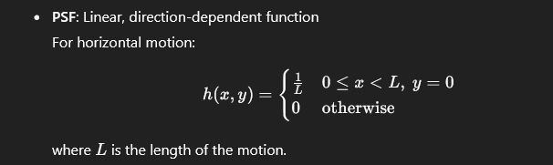
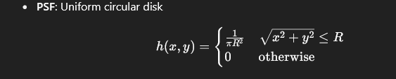
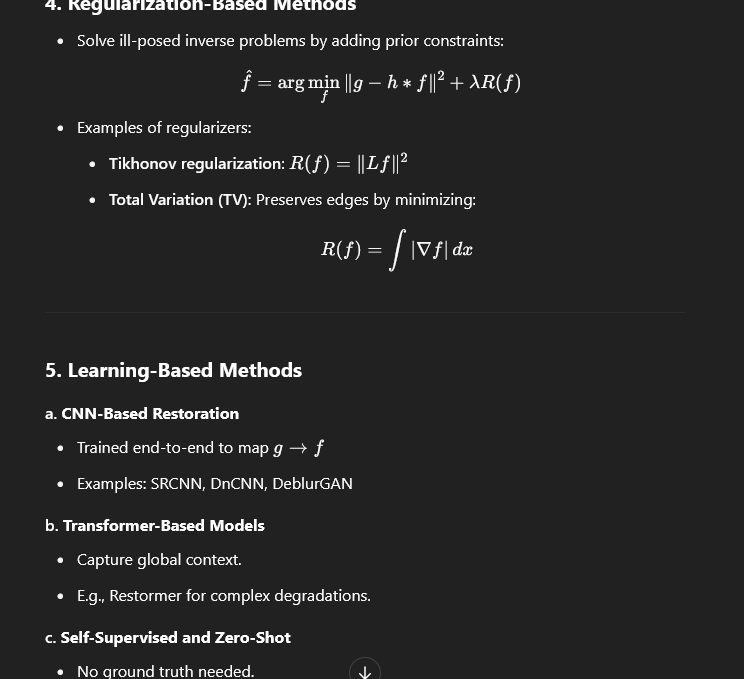

# Image degradation

- refers to the deterioration of the image quality due to various factors during acquisition, transmission, storage or processing. this degradation typically results in a corrupted version of the original image and can be mathematically modeled as:

    ```sh
        g(x,y) = h(x,y)*f(x,y) + n(x,y)
    ```
- f(x,y): oiriginal image
- h(x,y): degradation function
- *: convolution operation
- n(x,y): additive noise
- g(x,y): degraded image

## Types

### Blur

- *Motion blur*: caused by camera or object movement during exposure.
- *Out of focus*: due to misalignment of the lens focal plane
- *Gaussian blur*: simulates camera defocus or lens imperfections.

### Noise

- *Gaussian Noise*: Modeled as white nooise with normal distribution.

- *Salt and pepper noise*

- *Poisson noise*

- *speckle noise*

## Causes

- Sensor Limitations
- optical system flaws
- environmental conditions.

## Image Blur

- form of degradation where fine details are smeared, often due to averaging effects. 

- convolution of original image with a point smeared function.

1. Gaussian blur

- Causes: optical defocus, lens imperfection


2. Motion Blur

- Causes : relative motion b/w camera and object during exposure



3. Out-of-focus blur

- cause: inncorrect lens focus


4. Box blur

- cause: simple averaging filter applied over neighbourhood.

# Image restoration

- Image restoration techniques aim to recover the original image f(x,y) from its degraded version g(x,y)

## Deterministic Techniques(Filter based)

### Inverse filtering
- assumes no noise
- in frequency domain


### Weiner Filtering
- Assumes noise and signal are stationary random processes.
- minimizes mean square error:


### Constrained Least square filtering


## Statistical techniques

### Bayesian estimation(MAP,ML)

- uses prior knowledge of image and noise statistics
- Map estimate


### Markov random fields

- models spatial dependencies b/w pixels
- uses energy minimization with Gibbs priors.

## Blind deconvolution

- both h(x,y) and f(x,y) are unknown

- estimateh
- estimate f
- repeat until convergence

## Regularization- based methods

